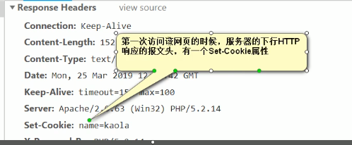
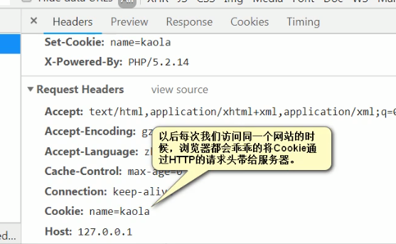
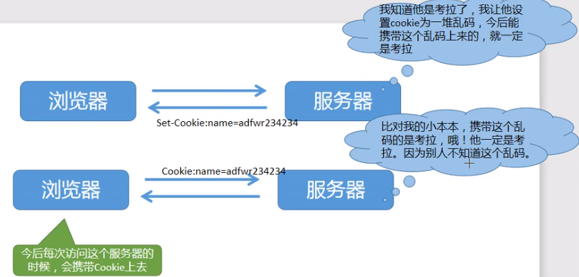

> 互联网设计初，自带一个问题：浏览器和服务器的`识别问题`。
> http 是无连接的，请求完毕之后，链接就会断掉。没有长久的数据通路。

#### 1. Cookie

- Cookie 就是在下行 HTTP 响应的报文中，添加 set-cookie 属性，要求浏览器设置 cookie。

- 浏览器在每一次请求中都需要在上行的请求报文头中，携带 cookie 上去，告诉服务器：“我是谁”！ 方便服务器对自己的识别。

> 优点：简单，明文存储

> 缺点：太过简单，容易被修改；明文存储，不安全；修改简单。需要每次请求时带上 cookie 发送给服务器。效率低。服务器端需要不断的 set_cookie.

- cookie 的用途：

  1） 存储数据（有 H5 本地存储之前）

#### 2. Session

Session 就是密文的 cookie。Session 不是新技术，只是设置 cookie 为一个乱码的字符串。

- 服务器和浏览器识别的唯一信息就是这个乱码字符串。

#### 3. Token

两个解密算法：
SHA256 、MD5

> MD5: MD5 消息摘要算法（英语：MD5 Message-Digest Algorithm），一种被广泛使用的密码散列函数，可以产生出一个 128 位（16 字节）的散列值（hash value），用于确保信息传输完整一致。加密算法包含信息：（ip、手机号、浏览器版本、系统版本等）

- 这两个加密算法都不可逆 ==[可以加密，但不可以反向解密]==

> 关键点：服务器掌握信息的算法，而浏览器只是掌握信息本身！

> token 是一个加密的字符串。里面包含有个人身份信息。token 不能判断用户是谁，只能校验数据合法性。

#### 4. 跨域

##### 4.1 代理跨域

浏览器有跨域限制，但是服务器不存在跨域问题，所以可以由服务器请求所要域的资源再返回给客户端。服务器代理是万能的。

代理服务器就是浏览器端A与请求服务器端C之间存在一个和浏览器同源的代理服务器B。浏览器A发送的请求都会被代理服务器B处理，发送个服务器C，然后把C的响应给浏览器A。

##### 4.2 CORS

CORS ：Cross-origin resource sharing，跨域资源共享。 就是被访问请求的服务器“自己”设置为 允许某些或者所有非同源客户端请求。此设置需要服务端修改。实现 CORS 通信的关键是服务器。只要服务器实现了 CORS 接口，就可以跨源通信。CORS 需要浏览器和服务器同时支持。目前，所有浏览器都支持该功能，IE 浏览器不能低于 IE10。
